# Calliope AI Desktop Applications

<div align="center">
  

  **Professional AI-Powered Development & Data Analysis Tools**

  [](#free--byok)
  [](#free--byok)
  [](#supported-platforms)

  **100% Free Desktop Apps — BYOK — API Pricing, No Middleman**
</div>

---

## Overview

Welcome to Calliope AI's desktop applications release repository. This is your central hub for downloading standalone, offline-capable versions of our professional development and data analysis environments.

Our desktop applications provide powerful, AI-enhanced tools for developers and data scientists, running entirely on your local machine with no cloud dependency required (except for optional AI provider connections).

---

## Free & BYOK

<div align="center">

### No Account. No Login. No Subscription. No BS.

**Just download and use. Bring your own API keys.**

</div>

- **100% Free** — No trials, no feature gates, no paywalls
- **No Account Required** — Download, install, and start working immediately
- **Bring Your Own Keys (BYOK)** — Use API keys from providers you already have
- **No Middleman** — Pay API pricing directly to your provider, zero markup from us
- **Offline Capable** — Core features work without internet

**Supported AI Providers:**
| Provider | Pricing | Notes |
|----------|---------|-------|
| [OpenAI](https://platform.openai.com) | Pay-as-you-go | GPT-4, GPT-4o, o1, etc. |
| [Anthropic](https://console.anthropic.com) | Pay-as-you-go | Claude models |
| [Google AI](https://ai.google.dev) | Free tier available | Gemini models |
| [Mistral](https://console.mistral.ai) | Pay-as-you-go | Mistral, Codestral, etc. |
| [Together AI](https://api.together.ai) | Pay-as-you-go | Open-source models |
| [AI21](https://studio.ai21.com) | Pay-as-you-go | Jamba models |
| [Cohere](https://dashboard.cohere.com) | Pay-as-you-go | Command models |
| [Ollama](https://ollama.ai) | Free | Run models locally, fully offline |

### Why This Matters

**Calliope AI IDE vs. Other AI Coding Tools:**

| | Calliope AI IDE | Cursor | GitHub Copilot |
|--|-----------------|--------|----------------|
| **App Cost** | Free | $20+/mo | $10-39/mo |
| **AI Provider** | BYOK (you choose) | Locked in | Locked in |
| **Account Required** | No | Yes | Yes |
| **Multi-model** | Yes | Limited | No |
| **Offline Capable** | Yes (with Ollama) | No | No |
| **Background Agents** | Yes | No | No |

**Calliope AI Lab vs. Other Data Science Tools:**

| | Calliope AI Lab | Jupyter + Copilot | Databricks |
|--|-----------------|-------------------|------------|
| **App Cost** | Free | Plugin fees | $$$/mo |
| **AI Provider** | BYOK (you choose) | Locked in | Locked in |
| **Account Required** | No | Yes | Yes |
| **Multi-model** | Yes | No | Limited |
| **Built-in AI Chat** | Yes | No | Yes |
| **Local Database** | Included | DIY | Cloud only |

---

## Available Applications

### 🚀 Calliope AI IDE

**A Professional AI-Enhanced Integrated Development Environment**

<p align="center">
  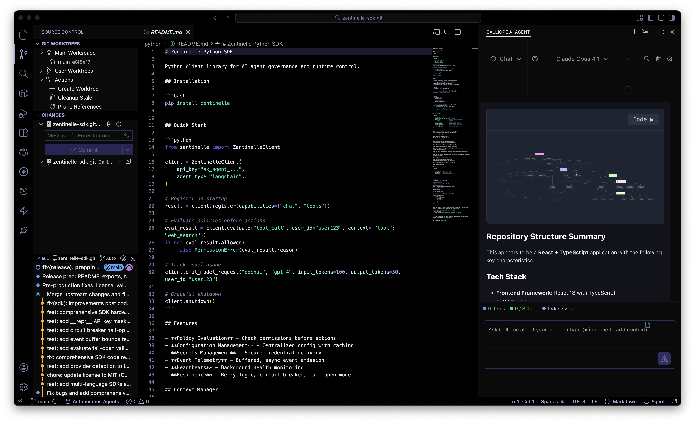
</p>

Calliope AI IDE is a full-featured development environment with integrated AI capabilities, custom theming, and powerful extensions for modern software development.

<details>
<summary><b>View more screenshots</b></summary>
<p align="center">
  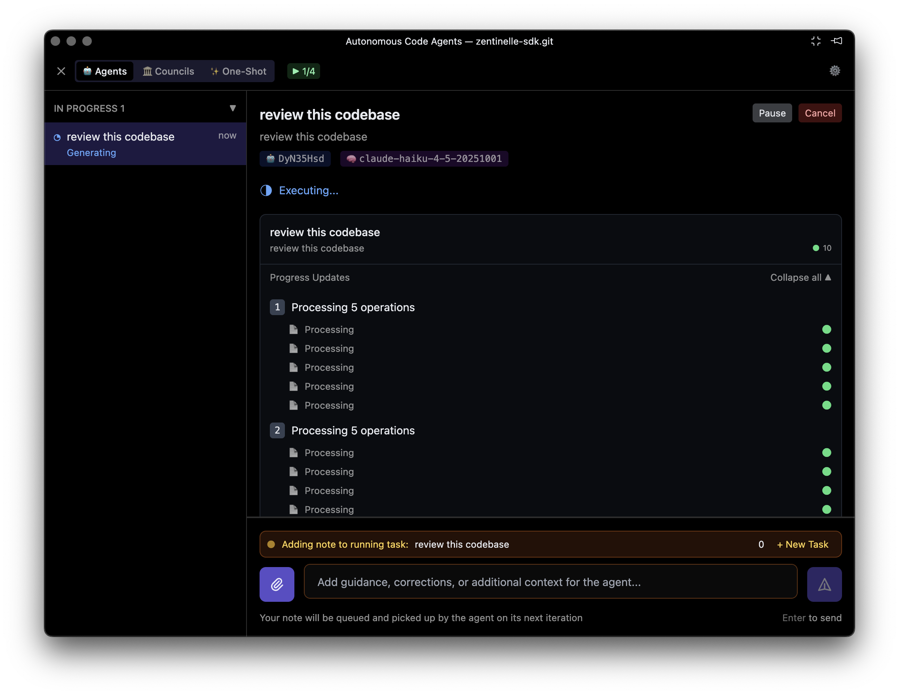<br/>
  <em>Autonomous agents running tasks in the background</em>
</p>
<p align="center">
  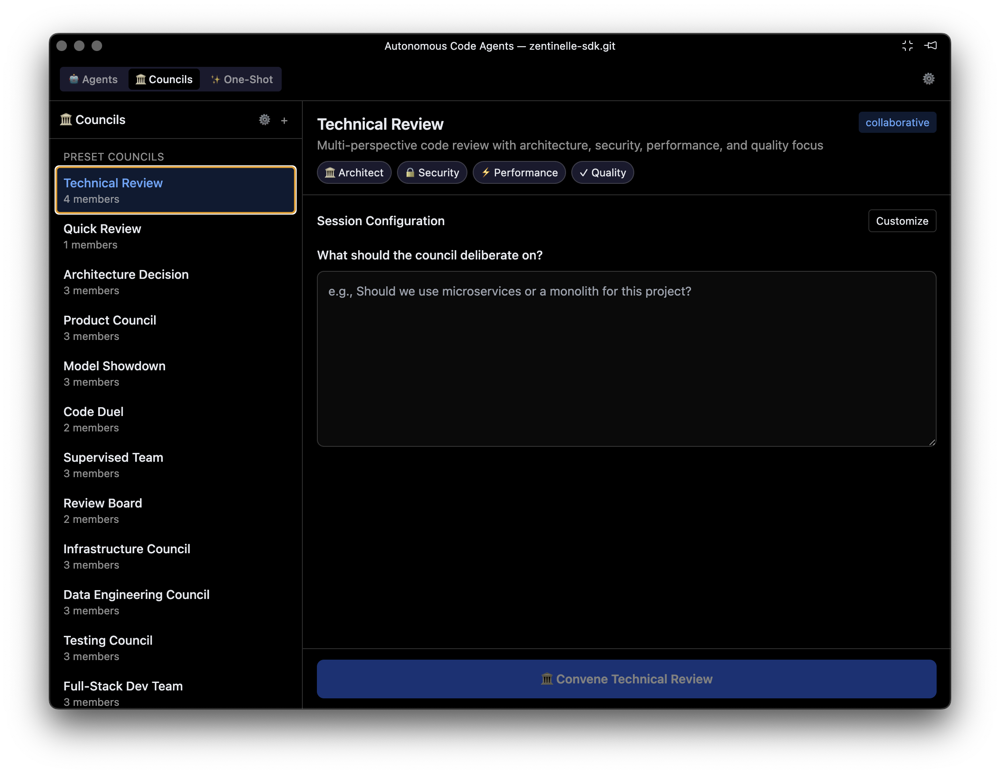<br/>
  <em>AI Councils - Multi-perspective code review and collaboration</em>
</p>
<p align="center">
  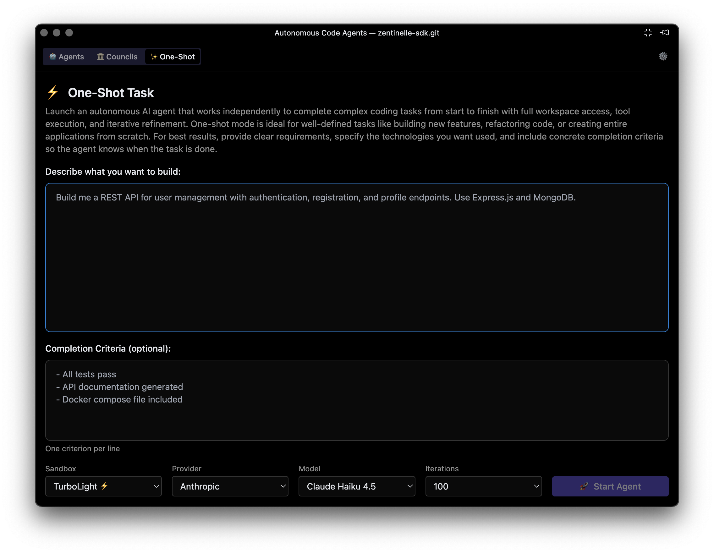<br/>
  <em>One-Shot Tasks - Launch autonomous agents to build features from scratch</em>
</p>
<p align="center">
  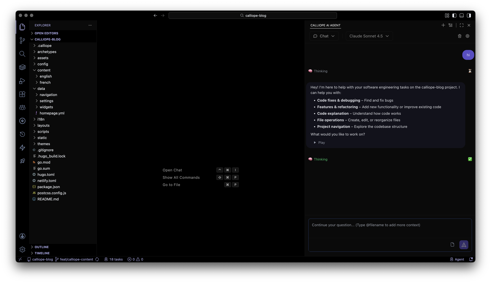<br/>
  <em>AI Chat - Ask questions, get code suggestions</em>
</p>
</details>

**Key Features:**
- Complete code editing environment with IntelliSense and debugging
- Multi-provider AI assistant integration (OpenAI, Anthropic, Google, Ollama)
- Custom Calliope branding and themes
- Extension marketplace compatibility
- Integrated terminal and Git support
- Offline capable (AI features require API keys)

**Perfect for:**
- Software developers
- DevOps engineers
- Full-stack development
- AI-assisted coding workflows

---

### 🔬 Calliope AI Lab

**Advanced AI-Powered Data Analysis Environment**

<p align="center">
  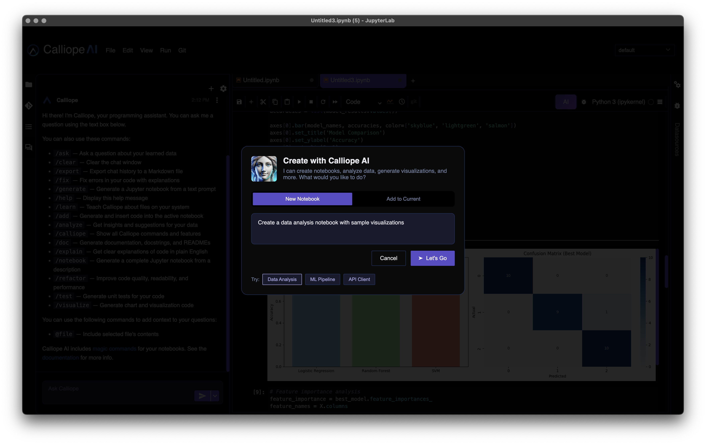
</p>

Calliope AI Lab combines a professional notebook interface with intelligent data agents, providing an all-in-one solution for data science and analysis work.

<details>
<summary><b>View more screenshots</b></summary>
<p align="center">
  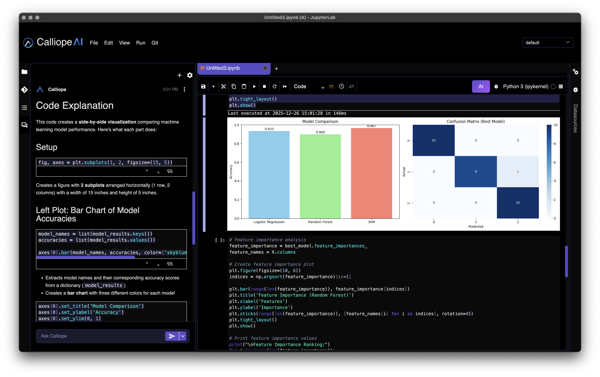<br/>
  <em>AI-powered code explanations and visualizations</em>
</p>
<p align="center">
  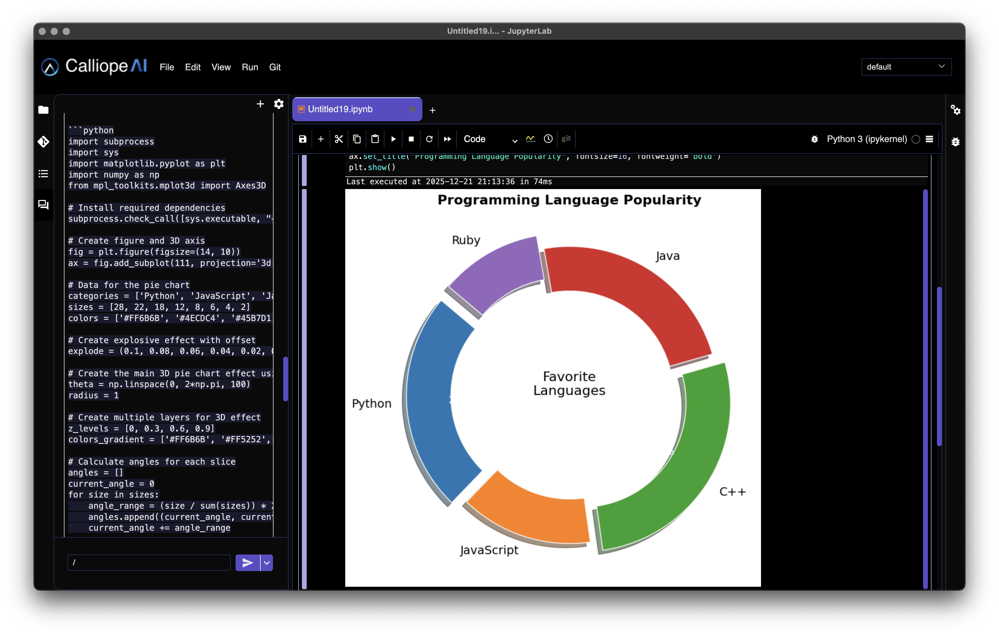<br/>
  <em>Advanced data visualizations</em>
</p>
<p align="center">
  <br/>
  <em>Configure AI providers and preferences</em>
</p>
</details>

**Key Features:**
- Interactive notebook environment for data analysis
- Chat Studio - AI-powered data analysis with natural language queries
- Multi-LLM support (Claude, OpenAI, Gemini, Ollama, and more)
- Complete Python data science stack included
- Local PostgreSQL database for data persistence
- Custom extensions and theming
- Completely offline capable

**Perfect for:**
- Data scientists
- Data analysts
- Machine learning practitioners
- Academic researchers
- Business intelligence professionals

---

## Supported Platforms

Both applications are available for the following platforms:

| Platform | Architectures | Package Formats |
|----------|--------------|-----------------|
| **macOS** | Intel (x64), Apple Silicon (ARM64) | `.zip` (application bundle) |
| **Windows** | x64 | `.zip` portable |
| **Linux** | x64 | `.deb`, `.rpm` |

---

## Downloads

### Latest Releases

> **⚠️ Note: Code Signing In Progress**
>
> We are currently in the process of signing our builds. Until signing is complete, you may see security warnings on macOS and Windows. This is normal for new software awaiting certification. See the [macOS Security Guide](#macos-security-guide) below for detailed instructions.

Downloads are available on the [Releases](../../releases) page.

### Installation Instructions

#### macOS
1. Download the appropriate `.zip` file for your architecture:
   - **Apple Silicon (M1/M2/M3)**: Download the ARM64 version
   - **Intel Mac**: Download the x64 version
   - **Universal**: Works on both (larger file size)
2. Extract the `.zip` file
3. Drag the application to your Applications folder
4. **First launch requires security approval** — See [macOS Security Guide](#macos-security-guide) below

#### Windows
1. Download the `.exe` installer or `.zip` portable version
2. Run the installer or extract the portable version
3. If SmartScreen appears, click "More info" → "Run anyway"
4. Follow the installation wizard

**PowerShell Alternative (Advanced Users):**
```powershell
# Remove the "downloaded from internet" marker
Unblock-File -Path "$env:USERPROFILE\Downloads\Calliope AI IDE Setup.exe"
```

#### Linux
**DEB (Debian/Ubuntu):**
```bash
sudo dpkg -i calliope-*.deb
sudo apt-get install -f  # Fix dependencies if needed
```

**RPM (Fedora/RedHat/CentOS):**
```bash
sudo rpm -i calliope-*.rpm
```

**AppImage:**
```bash
chmod +x Calliope-*.AppImage
./Calliope-*.AppImage
```

**TAR.GZ:**
```bash
tar -xzf calliope-*.tar.gz
cd calliope-*
./calliope-ide  # or ./calliope-lab
```

---

## macOS Security Guide

While our code signing is being finalized, macOS will show several security prompts when you first launch Calliope apps. **This is expected behavior** for apps not yet registered with Apple. Here's what to expect and how to proceed:

### Step 1: Open via System Settings

When you first try to open the app, macOS will block it. Go to **System Settings → Privacy & Security** and scroll down to see the blocked app notice. Click **"Open Anyway"**.

<p align="center">
  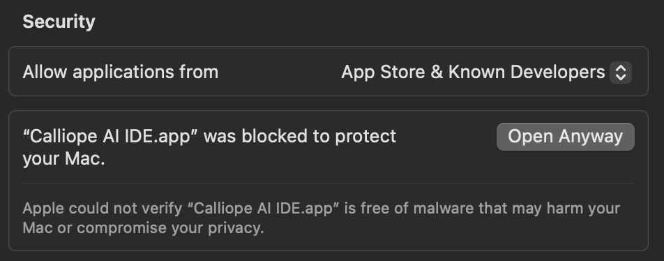
</p>

### Step 2: Confirm in Gatekeeper Dialog

A dialog will appear asking you to confirm. Click **"Open Anyway"** to proceed.

<p align="center">
  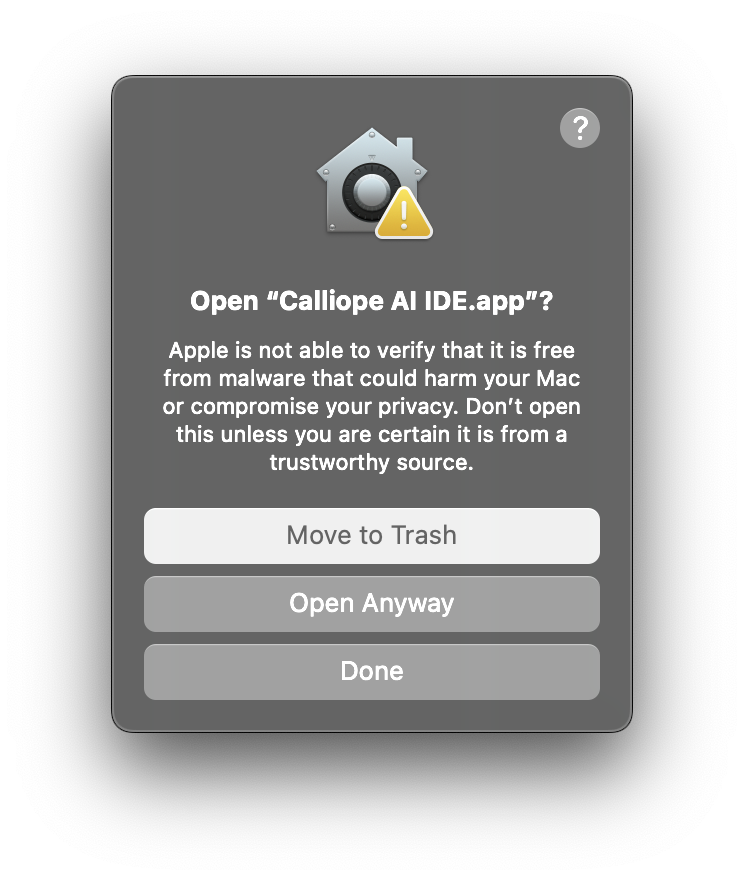
</p>

### Step 3: Authenticate with Touch ID or Password

macOS will ask for administrator authentication (Touch ID or password) to confirm you want to open the app.

<p align="center">
  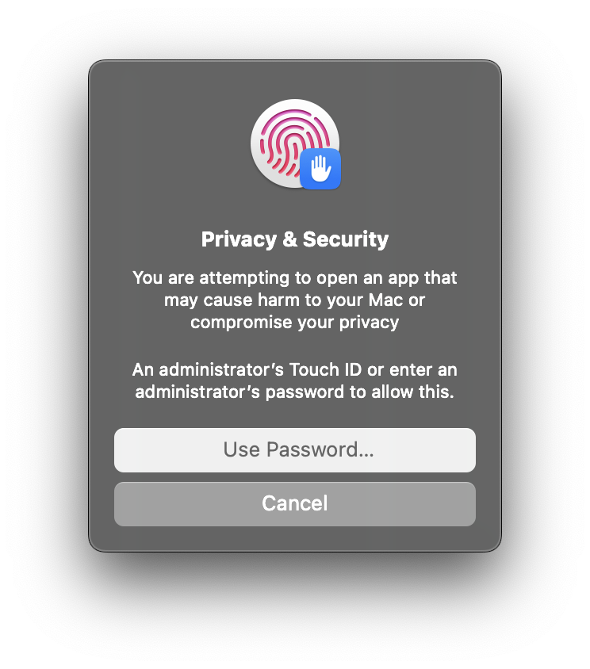
</p>

### Step 4: Allow Keychain Access (for API Key Storage)

Calliope apps securely store your API keys in your macOS Keychain. When prompted, enter your login keychain password and click **"Always Allow"** to grant permanent access.

<p align="center">
  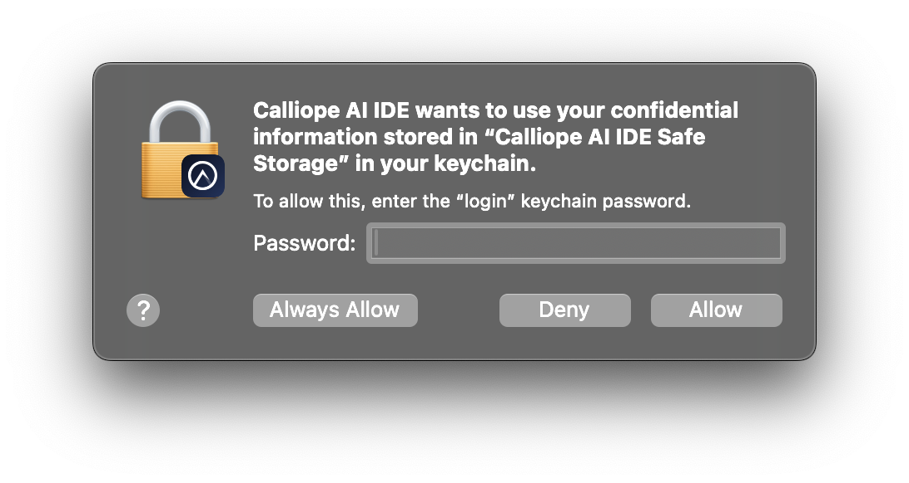
</p>

> **Why Keychain?** Your API keys are encrypted and stored in Apple's secure Keychain, the same system that protects your passwords and certificates. This ensures your credentials are never stored in plain text.

### Step 5: Allow App Data Access (Optional)

You may see a prompt asking to allow the app to access data from other apps. Click **"Allow"** if you want features like browser integration.

<p align="center">
  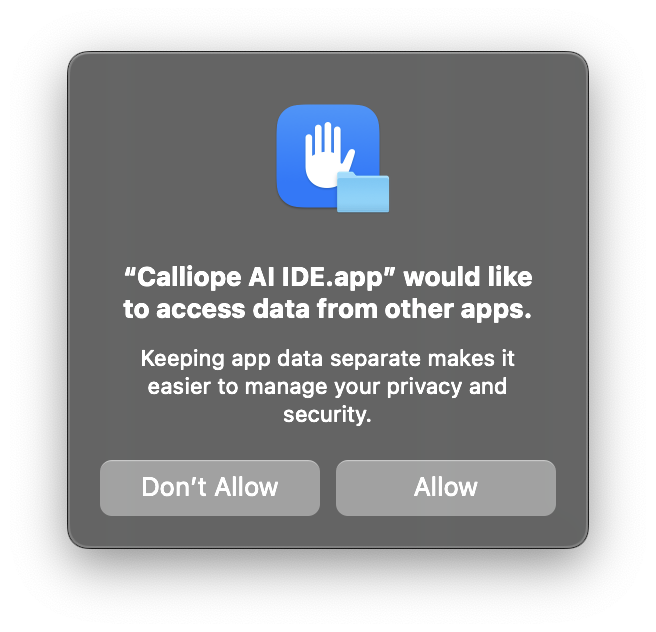
</p>

### After Initial Setup

Once you've completed these steps, the app will open normally on subsequent launches. You only need to go through this process once per app.

### Terminal Alternative (Advanced Users)

If you prefer the command line, you can remove the quarantine attribute directly:

```bash
# For Calliope AI IDE
xattr -dr com.apple.quarantine /Applications/Calliope\ AI\ IDE.app

# For Calliope AI Lab
xattr -dr com.apple.quarantine /Applications/Calliope\ AI\ Lab.app
```

This removes the `com.apple.quarantine` extended attribute that macOS adds to downloaded files, bypassing Gatekeeper warnings. The `-r` flag applies recursively to all files within the app bundle.

> **Note:** You'll still be prompted for Keychain access on first launch (Step 4 above).

### Calliope AI Lab - Additional Permissions

Calliope AI Lab follows the same security approval process as the IDE. You may also see prompts for folder access (e.g., Desktop, Documents) when working with local data files. Click **"Allow"** to enable data analysis on files in those locations.

<p align="center">
  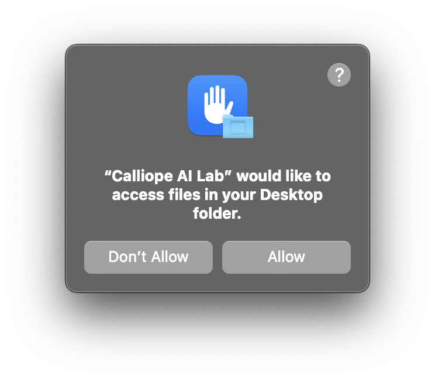
</p>

---

## Getting Started

### Calliope AI IDE

1. **First Launch**: Open the application and explore the welcome screen
2. **Configure AI Providers**: Add your API keys in Settings → AI Configuration
3. **Install Extensions**: Browse and install additional extensions from the marketplace
4. **Start Coding**: Create a new project or open an existing one

### Calliope AI Lab

1. **First Launch**: The application will initialize the Python environment (first launch may take a few minutes)
2. **Create a Notebook**: Start a new notebook from the launcher
3. **Configure Chat Studio**: Set up your LLM provider credentials for AI-powered data analysis
4. **Analyze Data**: Import datasets and start your analysis workflow

---

## Configuration

### AI Provider Setup

Both applications support multiple AI providers. You'll need API keys from your chosen providers. See the [full list of supported providers](#free--byok) above.

### Data Directories

**Calliope AI IDE:**
- Configuration: `~/.calliope-ide/`
- Extensions: `~/.calliope-ide/extensions/`
- User data: `~/.calliope-ide/User/`

**Calliope AI Lab:**
- Configuration: `~/.calliope-lab/`
- Notebooks: `~/CallipoeLab/` (default workspace)
- Database: `~/.calliope-lab/postgres/`

---

## System Requirements

### Minimum Requirements
- **RAM**: 4GB (8GB recommended)
- **Storage**: 2GB free space
- **OS Versions**:
  - macOS 10.15 (Catalina) or later
  - Windows 10 or later
  - Linux with glibc 2.28+ (Ubuntu 20.04+, Fedora 29+, etc.)

### Recommended Requirements
- **RAM**: 16GB or more
- **Storage**: 10GB+ free space (for data analysis workloads)
- **Internet**: Required only for AI provider API calls and extension downloads

---

## Philosophy

> **AI removes friction. You do real work.**

| AI Handles | You Handle |
|------------|------------|
| Boilerplate generation | Architectural decisions |
| Syntax & debugging | Business logic |
| Documentation drafts | Quality judgment |
| Code review assistance | System design |

These are serious tools for serious work — not toys.

---

## FAQ

<details>
<summary><b>Do I need to create an account?</b></summary>
No. Download, install, and start working. No signup, no login, no account required.
</details>

<details>
<summary><b>Is there a catch? How is this free?</b></summary>
The desktop apps are genuinely free. We make money from our cloud platform and enterprise offerings. The desktop apps are a way to let developers and data scientists experience Calliope with zero friction.
</details>

<details>
<summary><b>What do I need to use AI features?</b></summary>
API keys from your preferred AI provider(s). You pay them directly at their standard rates — we don't mark up or proxy your API calls.
</details>

<details>
<summary><b>Can I use this completely offline?</b></summary>
Yes! Core editing/notebook features work offline. For AI features, you can run <a href="https://ollama.ai">Ollama</a> locally for fully offline AI.
</details>

<details>
<summary><b>Is my data sent anywhere?</b></summary>
Your data stays on your machine. When you use AI features, your prompts go directly to your chosen AI provider — not through our servers.
</details>

<details>
<summary><b>Why do I see security warnings on macOS?</b></summary>
We are currently in the process of getting our builds signed with Apple. Until that's complete, macOS Gatekeeper will show warnings for unverified developers. This is normal — see our <a href="#macos-security-guide">macOS Security Guide</a> for step-by-step instructions to open the app safely.
</details>

<details>
<summary><b>Why does the app ask for Keychain access?</b></summary>
Your API keys are stored securely in the macOS Keychain (Apple's encrypted credential storage). This is far more secure than storing keys in plain text config files. Click "Always Allow" to grant permanent access.
</details>

<details>
<summary><b>Why should I use this instead of Cursor/Copilot?</b></summary>
Freedom. Use any AI provider (or multiple), switch anytime, pay API rates instead of subscriptions, work offline, no vendor lock-in.
</details>

---

## Documentation & Community

- **Documentation**: Available at [docs.calliope.ai](https://docs.calliope.ai)
- **Discord Community**: Join our Discord server at [discord.gg/Z9bbbE6hJv](https://discord.gg/Z9bbbE6hJv)
- **Support**: See [SUPPORT.md](SUPPORT.md) for help resources

---

## Support & Issues

### Reporting Issues

Found a bug or need help? Please open an issue on this repository:

1. Check [existing issues](../../issues) first
2. Provide system information (OS, version, architecture)
3. Include steps to reproduce
4. Attach logs if applicable

### Getting Help

- **Discord Community**: [discord.gg/Z9bbbE6hJv](https://discord.gg/Z9bbbE6hJv) - The fastest way to get help!
- **Support Guide**: See [SUPPORT.md](SUPPORT.md) for comprehensive help
- **Email**: support@calliope.ai

---

## Updates

Both applications include built-in update checking. You'll be notified when new versions are available.

To manually check for updates:
- **Calliope AI IDE**: Help → Check for Updates
- **Calliope AI Lab**: Help → Check for Updates

---

## License & Disclaimer

### Free to Use

These applications are provided **free of charge** for personal and commercial use. See [Free & BYOK](#free--byok) for details on the pricing model.

### No Warranty - Use at Your Own Risk

**IMPORTANT DISCLAIMER:**

THESE SOFTWARE APPLICATIONS ARE PROVIDED "AS IS", WITHOUT WARRANTY OF ANY KIND, EXPRESS OR IMPLIED, INCLUDING BUT NOT LIMITED TO THE WARRANTIES OF MERCHANTABILITY, FITNESS FOR A PARTICULAR PURPOSE, AND NONINFRINGEMENT.

IN NO EVENT SHALL CALLIOPE LABS INC, ITS DEVELOPERS, CONTRIBUTORS, OR AFFILIATES BE LIABLE FOR ANY CLAIM, DAMAGES, OR OTHER LIABILITY, WHETHER IN AN ACTION OF CONTRACT, TORT, OR OTHERWISE, ARISING FROM, OUT OF, OR IN CONNECTION WITH THE SOFTWARE OR THE USE OR OTHER DEALINGS IN THE SOFTWARE.

**By downloading and using these applications, you acknowledge and agree that:**

- You use these applications entirely at your own risk
- You are solely responsible for any consequences of using these applications
- Calliope Labs Inc makes no guarantees about the functionality, reliability, or security of these applications
- You are responsible for maintaining backups of your work
- You are responsible for compliance with any applicable laws and regulations in your use of these applications
- Any AI features require third-party API keys, and you are responsible for your usage of those services

### Third-Party Components

These applications include third-party open-source components. See the `LICENSES` directory in each application for details.

### AI Provider Terms

Use of AI features requires compliance with your chosen AI provider's terms of service:
- OpenAI Terms: [openai.com/policies](https://openai.com/policies)
- Anthropic Terms: [anthropic.com/legal](https://www.anthropic.com/legal)
- Google AI Terms: [ai.google.dev/terms](https://ai.google.dev/terms)

---

## About Calliope Labs

Calliope Labs Inc is dedicated to building professional AI-enhanced tools for developers and data scientists. Our mission is to make advanced AI capabilities accessible and practical for everyday workflows.

**© 2025 Calliope Labs Inc - All Rights Reserved**

---

## Version History

See [CHANGELOG.md](CHANGELOG.md) for detailed version history and release notes.

---

<div align="center">
  <p>Built with care by the Calliope Labs team</p>
  <p>
    <a href="https://calliope.ai">Website</a> •
    <a href="https://docs.calliope.ai">Documentation</a> •
    <a href="https://discord.gg/Z9bbbE6hJv">Discord</a> •
    <a href="https://github.com/CalliopeAI">GitHub</a>
  </p>
</div>
